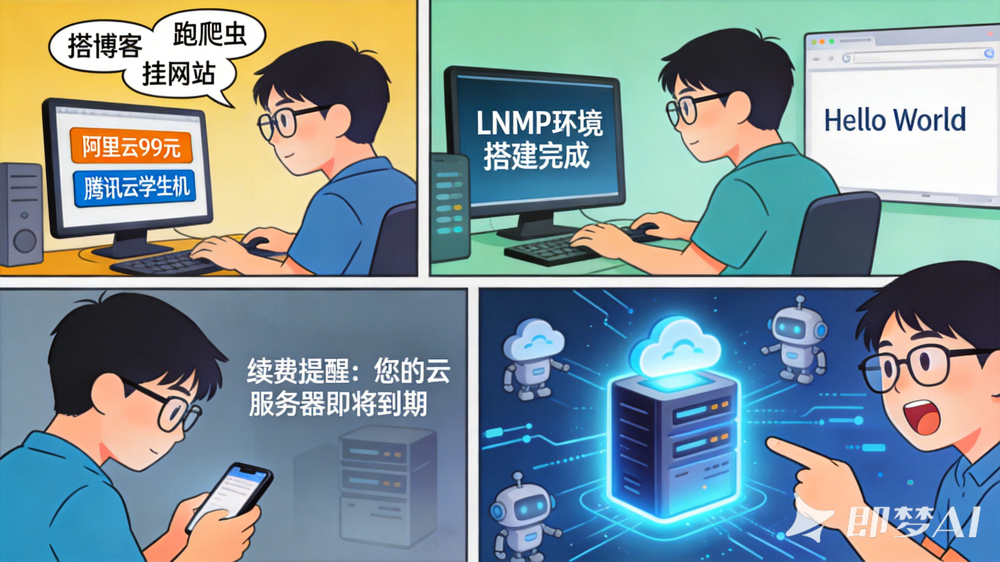

# 买完云服务器只会跑个博客？配上AI，这些玩法才值回票价

先说个可能让你感同身受的事。

你是不是也有一台云服务器？可能是阿里云99元那款，也可能是腾讯云的学生机。当时买的时候想得很美：搭个博客、跑个爬虫、挂个网站。结果折腾完LNMP环境，发了两篇"Hello World"，然后就没有然后了。

直到续费短信来了，你才想起来：哦，我还有台服务器。

其实不是你的问题。过去个人服务器的想象力确实有限。但AI普及之后，事情变得不一样了。

现在的AI模型（不管是开源的Llama 3、Qwen，还是各种API）最大的特点是：**它们需要有一个"常驻"的地方**。你的笔记本电脑会关机，手机会没电，但云服务器可以7x24小时不休息。

这篇文章整理了过去一年社区里一些**已经被验证过、门槛不算高、真的有人在用**的玩法。不保证能帮你赚钱，但至少能让你的服务器不再吃灰。

## 一、把它变成你的"私人信息处理中心"

这是最务实、也最容易上手的方向。不需要显卡，不需要高配置，2核2G的入门机型足够。

### 1. 订阅源的精读助手

现在信息过载严重。你可能订阅了几十个RSS、关注了上百个公众号、还要看各种研报和新闻。人类根本看不过来。

**解法很简单：** 在服务器上跑一个定时任务（cron job），每天早上6点，抓取你订阅的所有内容源，丢给AI做三件事：

- 总结每篇文章的核心观点（200字以内）
- 标记出跟"你的工作/持仓/兴趣"强相关的内容
- 生成一份每日简报，推送到你的微信/钉钉/飞书

**真实案例：** 一个做二级市场的朋友，用这个方案替代了每天早上花1小时刷资讯的习惯。现在他起床看一眼简报，就知道今天需要重点看哪几件事。

**技术实现：** 开源项目如OpenClaw、Dify都可以做到，部署时间不超过30分钟。

### 2. 全平台的"稍后阅读"终结者

你是不是也收藏了一堆文章到Pocket、Instapaper、或是微信收藏，然后再也没有打开过？

一个进阶玩法：服务器每周日晚上自动扫描你的"稍后阅读"列表，把所有未读文章拉下来，让AI生成一份 **"精华摘要包"** 。那些真正值得精读的，保留；那些标题党烂文，AI直接帮你过滤掉。

原理不复杂：服务器就像你雇的一个实习生，活儿干得可能不那么完美，但它确实7x24小时不睡觉，而且几乎不要工资。

## 二、把它作为AI应用的中转枢纽

很多人对AI的使用还停留在"打开网页 -> 输入问题 -> 复制答案"的阶段。但真正高效的使用方式，是让AI主动为你服务。

### 1. 自动化内容生产（非营销向）

注意，这里说的不是批量洗稿去骗流量，而是**解决真实的重复劳动**。

一个典型的例子：有个做跨境电商的朋友，每天要写几十个产品描述。这些描述不需要多惊艳，但要合规、准确、包含关键词。他写了一个脚本：服务器每天从数据库读取商品参数（材质、尺寸、用途），调用大模型API生成描述，再自动上传到店铺后台。

**效果：** 每天节省2小时，而且生成的描述比他自己写的更规范（因为模型不会忘记包含"退货政策"和"安全警告"）。

另一个例子：有科技博主用这套流程自动生成**每日AI资讯早报**。服务器每天早上抓取Arxiv、Hacker News、Reddit的热门帖子，让模型筛选出真正有价值的内容（而不是蹭热度的垃圾），生成一份带链接和摘要的邮件，发给订阅用户。

### 2. 私人的"智能体管家"

现在已经有很多开源项目（如OpenClaw、Astra）可以让你搭建一个**私有的、可扩展的智能体**。

这个智能体可以：

- 帮你监控某个商品的价格，降价时自动提醒
- 帮你追踪某个竞品的动态，官网更新时抓取变化并总结
- 帮你自动回复那些"不太重要"的邮件（比如确认收到、自动分类）

关键在于：**所有数据都在你自己的服务器上**，不会泄露给第三方。这是直接用ChatGPT网页版做不到的。

## 三、如果你有GPU服务器（或者不介意用API）

上面说的所有玩法，用CPU服务器+调用API就能实现，成本极低（API调用一个月可能也就几十块）。

但如果你买的是GPU服务器（或者租的按量付费实例），可以做的事情更多。

### 1. 本地化的AI绘画流水线

Stable Diffusion、Flux这些开源模型可以跑在自己的服务器上。

**实际用途（不是画着玩）：**

- 生成电商产品的场景图（比如把一个杯子"放进"不同风格的客厅背景里）
- 生成游戏开发用的素材（立绘、图标、背景）
- 批量生成特定风格的配图（用于公众号、小红书）

一个真实的案例：一个小型独立游戏开发团队，用一台GPU服务器生成了200多张角色立绘的草稿，最后挑了10张请画师精修。成本比直接外包节省了80%。

### 2. 本地代码补全/私有化Copilot

如果你写代码，可以部署CodeGemma、DeepSeek-Coder这类模型。虽然比不上GitHub Copilot那么强，但优势是：

- 免费（不花那每月10美元）
- 私有（代码不会上传到微软的服务器）
- （选做）可以针对你自己的代码库做微调，让它更懂你的项目风格

配置要求不算低，但如果你是个频繁写代码的人，这个体验值得折腾一次。

## 实际操作：最低成本的起步方案

如果你是第一次接触这类玩法，建议从最简单的开始：**用一台入门级的云服务器，配合现成的开源工具（如OpenClaw）**，先跑通整个流程，感受一下"AI自动化"到底是什么体验。

等你熟悉了，再根据自己的需求升级配置、加GPU、加存储。一步一步来，别一上来就想搞个大新闻。

